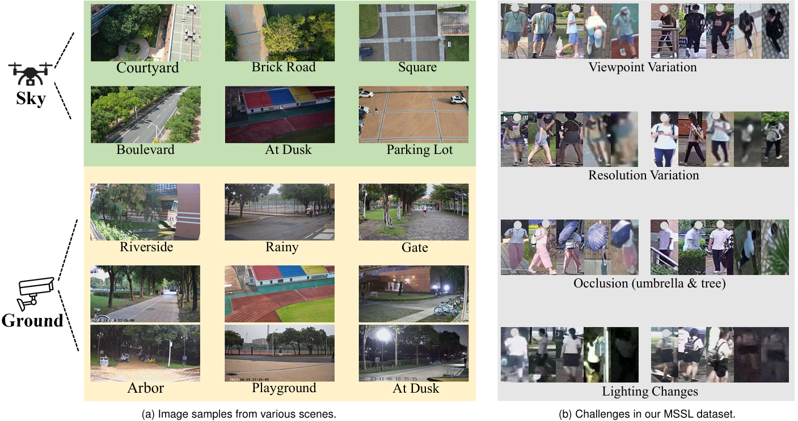

# Dataset Description

Multi-Source Sky-Land person Re-ID dataset (MSSL) includes 66,928 images from 2,099 volunteers in nearly 20 unique scenes. For evaluation, we divide the MSSL dataset into a training set and a test set, maintaining an approximately 1:1 ratio. The training set contains 35,330 images representing 1,125 unique identities, while the test set includes 31,598 images of 974 distinct identities. There is no identity overlap between the training and test sets. We also provide three different evaluation protocols:    

- **Ground-Sky** mode: The query images are captured by ground cameras, and during the retrieval process, correct pedestrian images from ground cameras are filtered out.

- **Sky-Ground** mode: The query images are captured by sky cameras, and during the retrieval process, correct pedestrian images from sky cameras are filtered out.

- **Dual-Domain Cross** mode: The query consists of images from sky and ground. During retrieval, only images captured by the same camera or drone are filtered out.


The identity label of each pedestrian image can be extracted from its filename. For example, in the image `0065_0909am_3_G003_c05_p0065_p0115_p0167_00.jpg`, the digits before the first underscore (`0065`) indicate the pedestrian ID, while the character between the fourth and fifth underscores (`c05`) denotes the camera ID. In our dataset, cameras `c01`, `c02`, `c03`, `c06`, `c07`, `c08`, `c11`, `c12`, `c13` are ground cameras, whereas the remaining cameras `c04`, `c05`, `c09`, `c10`, `c14`, `c15` are sky cameras.



# How to Get Our MSSL Dataset?

Please read and comply with the terms and conditions before downloading the dataset:


- This dataset is strictly for non-commercial use only, including but not limited to teaching, academic research, public demonstrations, and personal experimentation. You are prohibited from using this dataset or any derivative works for commercial purposes in any form. Commercial purposes include, but are not limited to, using the dataset for business operations, licensing, leasing, selling, distributing with commercial products, or incorporating it into the development or use of commercial products, or any activity aimed at generating commercial profit for yourself or others.

- This dataset can not be copied, shared, distributed, resold, offered for resale, transferred, or sublicensed in whole or in part, except for making a single copy for archival purposes only. Images or videos from the dataset may be used and modified for scientific publications, supplementary materials for scientific publications, presentations, and public demonstrations.

You can access the dataset via the following download link: [https://pan.baidu.com/s/1y9P13i0hci8UlNFDIlmg8g](https://pan.baidu.com/s/1y9P13i0hci8UlNFDIlmg8g). To obtain the extraction code, please download and complete `dataset_agreement.pdf`, then send it to **chenhx87@mail2.sysu.edu.cn**.


# Instructions for Running our Code MSP


- To begin, configure the environment as described in the [CLIP-ReID](https://github.com/Syliz517/CLIP-ReID).


- Then, You need to modify the bottom of configs/person/vit_clipreid.yml to:

```yaml
DATASETS:
  NAMES: ('mssl')
  ROOT_DIR: ('your_mssl_dataset_dir')
OUTPUT_DIR: 'your_output_dir'
```

- In the first stage, images from the drone and ground views in the `bounding_box_train` folder need to be processed separately.  
We modify Line 215 in `make_model_clipreid.py` from: `ctx_init = "A photo of a X X X X person."` to:

  - For the drone view: `ctx_init = "A sky photo of a X X X X person."`

  - For the ground view: `ctx_init = "A ground photo of a X X X X person."`

  - Regardless of whether the view is sky or ground, Line 222 `n_ctx = 4` should be changed to `n_ctx = 5`. 
    

- Training:
  ```bash
  CUDA_VISIBLE_DEVICES=1 python train_clipreid.py --config_file configs/person/vit_clipreid.yml  MODEL.SIE_CAMERA True MODEL.SIE_COE 0.5 MODEL.SIE_VIEW True MODEL.STRIDE_SIZE '[12, 12]'
  ```

- After completing the first-stage training, to avoid reloading the trained weights, we recommend saving the learned `text_features` for each identity in advance. These features can then be directly used for multimodal alignment in the second training stage. After separately training the multimodal features for the sky and ground domains, we retrain the entire training set as a whole. The number of training epochs for the first stage can be set to 1, since the focus is now on the second-stage training:

  ```bash
  CUDA_VISIBLE_DEVICES=2 python train_clipreid.py --config_file configs/person/vit_clipreid.yml  MODEL.SIE_CAMERA True MODEL.SIE_COE 0.5 MODEL.SIE_VIEW True MODEL.STRIDE_SIZE '[12, 12]'
  ```
  

- Mode Evaluation

  - **Sky-Ground** Mode:
  ````bash
  CUDA_VISIBLE_DEVICES=1 python test_clipreid.py --config_file configs/person/vit_clipreid.yml MODEL.SIE_CAMERA True MODEL.SIE_COE 0.5  MODEL.SIE_VIEW True MODEL.STRIDE_SIZE '[12, 12]' TEST.EVAL_MODE 'S2G' TEST.WEIGHT 'the_path_to_your_pth'
  ````
  - **Ground-Sky** Mode: 
  ````bash
  CUDA_VISIBLE_DEVICES=2 python test_clipreid.py --config_file configs/person/vit_clipreid.yml MODEL.SIE_CAMERA True MODEL.SIE_COE 0.5  MODEL.SIE_VIEW True MODEL.STRIDE_SIZE '[12, 12]' TEST.EVAL_MODE 'G2S' TEST.WEIGHT 'the_path_to_your_pth'
  ````
  - **Dual-Domain Cross** Mode: 
   ````bash
  CUDA_VISIBLE_DEVICES=3 python test_clipreid.py --config_file configs/person/vit_clipreid.yml MODEL.SIE_CAMERA True MODEL.SIE_COE 0.5  MODEL.SIE_VIEW True MODEL.STRIDE_SIZE '[12, 12]' TEST.EVAL_MODE 'DDC' TEST.WEIGHT 'the_path_to_your_pth'
  ````

  - We follow the same settings for evaluation on other baselines, such as TransReID. This filtering setting is more challenging. Setting `MODEL.STRIDE_SIZE` to `'[12, 12]'` can effectively enhance the model's performance, including improvements on [AG-ReID](https://github.com/huynguyen792/AG-ReID). For AG-ReID dataset, please refer to [agreid.py](https://github.com/huynguyen792/AG-ReID/blob/main/agreidtools/datasets/agreid.py). We use the original arXiv version of this dataset (2023), specifically the one where `bounding_box_test_all_c3` contains 3,331 images.

  
  
If you have any questions, please feel free to contact me at **chenhx@mail2.sysu.edu.cn**.


# Acknowledgment
Thanks to [CLIP-ReID](https://github.com/Syliz517/CLIP-ReID) and [AG-ReID](https://github.com/huynguyen792/AG-ReID) for the support.